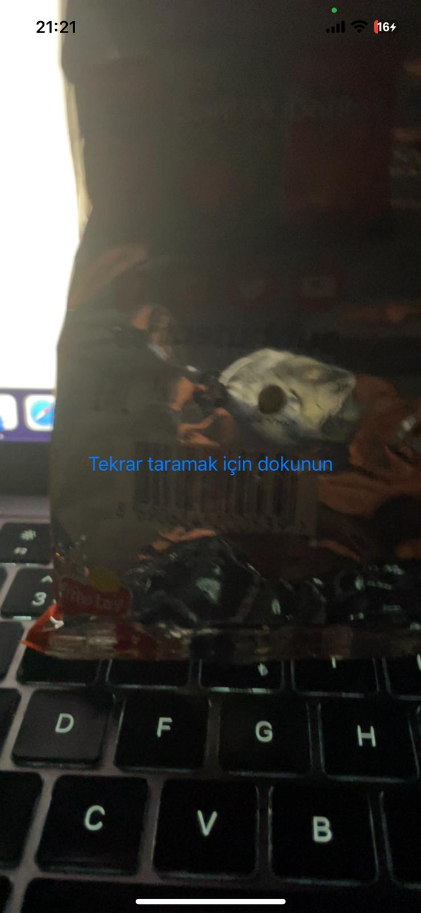
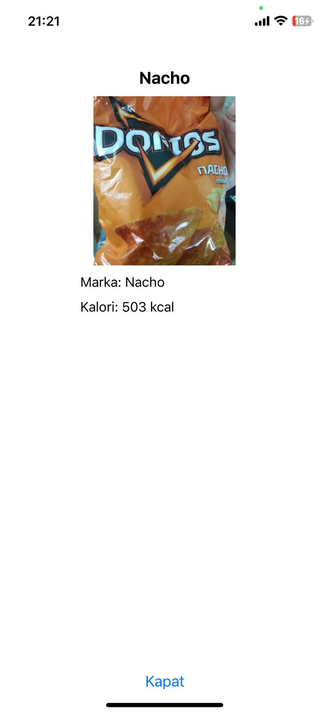

# Ürün Tarama Uygulaması

Bu React Native uygulaması, barkod tarayıcı kullanarak ürün bilgilerini getirir ve kullanıcıya gösterir. Uygulama Expo Camera modülünü kullanır ve Open Food Facts API'sinden ürün bilgilerini alır.

## Kullanılan Teknolojiler
- React Native
- Expo Camera
- Axios

## Kurulum
1. Projeyi klonlayın:
    ```bash
    git clone https://github.com/Alperenhks/react-native-barcode.git
    cd react-native-barcode
    ```

2. Gerekli paketleri yükleyin:
    ```bash
    npm install
    ```

3. Uygulamayı çalıştırın:
    ```bash
    expo start
    ```

## Kullanım
- Uygulama açıldığında, kamera izni istenir. İzin verildikten sonra kamera açılır.
- Barkod taratıldığında, ürün bilgileri getirilir ve bir modal içinde gösterilir.
- "Tekrar taramak için dokunun" butonuna basarak yeni bir barkod tarayabilirsiniz.
- "Kapat" butonuna basarak modalı kapatabilirsiniz.

## Ekran Görüntüleri





## Katkıda Bulunanlar
- https://world.openfoodfacts.net (endpoin bilgisi)

